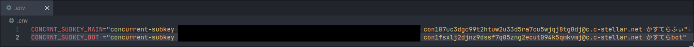

# A Little Deeper Dive into Concrnt
「Hello Nostr, Yo Bluesky 3 未来を担う分散型SNS」(技術書典17にて頒布)内の記事、「A Little Deeper Dive into Concrnt」に掲載されているサンプルコードをまとめたリポジトリです。

## 環境セットアップ
サンプルコードを実際に動かすために必要な、環境のセットアップ手順を示します。

### GitHub Codespacesを利用する方法

GitHubのアカウントを持っていない場合は、まず画面右上の「Sign up」よりアカウントを作成してください。

GitHubアカウントでログインした状態で以下の操作を行います。
1. 緑色の「Code」ボタンをクリック
2. 開いたドロップダウン内の「Codespaces」タブをクリック
3. 「Create codespaces on main」をクリック

「Setting up your codespace」という画面でしばらく待機していると、エディタ画面に切り替わります。これで準備完了です。

--- 

<details>
<summary>ローカルマシン上にセットアップ(開発者向け)</summary>

### ローカルマシンに開発コンテナ(Dev Containers)を利用してセットアップ

前提: Visual Studio Code (以下 VSCode)、[Dev Containers 拡張機能](https://marketplace.visualstudio.com/items?itemName=ms-vscode-remote.remote-containers) 、Docker のインストール

1. この演習環境リポジトリをクローンし、VSCodeでディレクトリを開きます。

```bash
git clone https://github.com/jiftechnify/a-little-deeper-dive-into-concrnt.git
code a-little-deeper-dive-into-concrnt
```

2. VSCode内でコマンド「Dev Containers: Reopen in Container(開発コンテナ: コンテナで再度開く)」を実行します。

開発コンテナ内でエディタが開いたら準備完了です。


### ローカルマシンに手動でセットアップ

1. [Deno](https://deno.com/runtime)をインストールします(既にインストール済みの場合はスキップしてください)。

```bash
# macOS または Linux の場合
curl -fsSL https://deno.land/x/install/install.sh | sh

# Windows の場合 (PowerShell)
irm https://deno.land/install.ps1 | iex
```

2. 次に、以下のコマンドで演習環境をクローンし、演習環境のディレクトリに移動します。

```bash
git clone https://github.com/jiftechnify/a-little-deeper-dive-into-concrnt.git
```

3. お好みのエディタで演習環境のディレクトリを開きます。
  - 必要に応じてDenoでのプログラミング用の拡張機能・プラグインをインストールするとよいでしょう

</details>

## サンプルコードの実行方法
### サブキーの設定
ファイル`.env.example`をコピーして`.env`にリネームします。`.env`を開き、`CONCRNT_SUBKEY_MAIN`の値として、普段お使いのアカウントのサブキーを設定します。

2章のBotのコードを動かす場合は、普段づかいのアカウントとは別にBot用アカウントの作成をおすすめします。Bot用アカウントのサブキーは、`.env`の`CONCRNT_SUBKEY_BOT`に設定します。

Cocnrntアカウントのサブキーは、concrnt.worldにサブキーでログインした上で[設定 → ID管理](https://concrnt.world/settings/identity)ページから取得してください。

設定例:



<details>
<summary>実験用タイムラインの設定(任意)</summary>

### 実験用タイムラインの設定(任意)
サンプルコードを実行すると、Concrnt上に投稿を行います。デフォルトではこちらで事前に用意した[実験用タイムライン](https://concrnt.world/timeline/t176yga9jrp4c41d60693rjech0@c.c-stellar.net)に投稿されるようになっていますが、代わりに自分で独自に用意した実験用タイムラインを使うようにすることも可能です。そのための手順は以下のとおりです。

1. concrnt.worldの[探索](https://concrnt.world/explorer/timelines)ページを開き、コミュニティタイムライン一覧の右側にある「新しく作る」ボタンをクリック
2. タイムライン名などを入力して「作成」をクリック
3. 新規作成されたタイムラインのページが開くので、画面右上のボタンをクリック
4. タイムラインの情報が画面右側に表示される。タイムライン名の直下に小さく表示されている「t」からはじまる文字列がタイムラインのIDなので、これをクリックしてコピーする
5. `consts.ts`を開き、コピーしたタイムラインIDをペースト
</details>

### 実行
記事内のサンプルコードの先頭には `/* c1-1: ... */` のようなコメントが記載されていますが、この「c」からはじまるのがサンプルコードの名前です。

実際にサンプルコードを動かすには、ターミナルを開いて以下のコマンドを実行します。

```bash
deno task run-sample <サンプルコード名>
```

例えば、記事の一番最初のサンプルコードを動かすには、`deno task run-sample c1-1`を実行してください。

## ライセンス
MIT